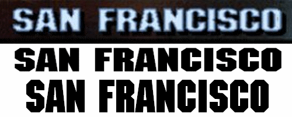
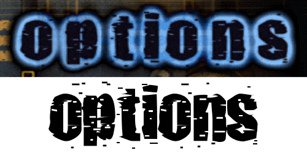

This repository is the new home for the THPS fonts hunt started back in 2014. The original thread titled "THPS source fonts (TrueType, vector, HD, whatever)" was hosted on [thmods.com website \(archived link\)](http://web.archive.org/web/20240211055209/http://thmods.com/forum/viewtopic.php?t=489).

# Introduction
Call me a font maniac, as I'm the one who was bored enough to write the font tool for THPS games and now this, but fonts are actually a very important part of game design. Anyways, if you ever wanted to write something using a font from a Tony Hawk game, chances are that you will find it here. For a long time I thought these games use some exclusive designs, cause I never seen these fonts outside Tony Hawk games, but occasionaly this is not the case. Most of these fonts, if not all of them, actually have their Truetype sources. However, most of these fonts are commercial, but it doesn't hurt to try it on a preview page. So prepare yourself to scroll down if you're interested in. Of course a lot of fonts are missing for now, so if by a chance you're familiar with other sources, share the knowledge.

# Ways to contibute
Since we're on hosted on the Github now, feel free to open issues to discuss potential candidates. You can also join the LegacyThps server on Discord or write me an e-mail if you wish. Any contributions are welcome.

# Contributions
Credit where credit's due. People contributed to the list:
* thmods.com: dcxdemo, ThAeM, AxlRocks
* WhatTheFont: Tecnotronic, Lobotomy

# !!! Warning !!!
Please keep in mind that most fonts uses in Tony Hawk's games are licensed and are **not free to use**. Please thoroughly refer to the font's license before using it in your project. The MIT license in this repo refers to the collected and structured information about these fonts, not to the fonts themselves!

# WANTED fonts
There are many fonts yet to be found. Here's a brief list of most wanted fonts so far:
* THPS2 career goal font (comic sans?)
* THPS2x header font (main menu title, paused text)
* THPS3 trick string (gonzalez?)
* THPS4 trick string
* THUG trick string
* THUG logo font
* THAW UI font (some typewriter font)
* TH Downhill Jam trick string
* TH Downhill Jam UI font
* THP8 UI font
* THPS5 logo font
* THPS1+2 logo font

Some missing font samples for the reference:

# Tony Hawk's Pro Skater

## Helvetica (could be some variant of it)
* Link: http://www.fonts.com/font/linotype/helvetica
* Usage: THPS1 logo upper part, "tony hawk's"

Probably the most unimpressive font ever used in a Tony Hawk's game. You can see letters N and A are lowercase, this is somewhat Neversoft used a lot in their designs. Also, the apostrophe is a bit different in the actual font, it looks like they just put the comma up there.

## Lithia
* Link: https://www.myfonts.com/fonts/t26/lithia/
* Usage: THPS1 logo lower part, "pro skater"

You can see everything is pretty same except the T letter. Either there was an older version of Lithia with normal T, or Neversoft decided to redesign this letter, cause I did not find any other variation of this font. 

## ITC Machine
* Link: https://www.myfonts.com/fonts/itc/machine/
* Usage: nearly every in-game string - trick font, menu items font, headers font

The signature "THPS1" font. While searching for this one I found several threads where people were hopelessly asking what font it is. ITC Machine it is. You can find several differences in the game font, but I believe those are caused due to low resolution of the original bitmaps. The actual font is not as wide as well, I did not find any wider version than the bold one.

## Punk Ass Bitch
* Link: http://www.dafont.com/punkassbitch.font
* Usage: menu font on the right side (options, player select, etc)

A rather random font name, ain't it? 

## Contour Generator
* Link: https://www.dafont.com/contour-generator.font
* Usage: PAUSED text in pause menu 

Basically, RCA font. Thanks AxlRocks for this contribution.

# Tony Hawk's Pro Skater 2

## 76London Fall
* Link: http://www.azfonts.net/load_font/76london-fall.html
* Usage: THPS2 logo

I always thought this was an exclusive design, however, here is the original font. Wherever you'll see this, you'll say it's so THPS2. You can clearly see they squished the text a bit for the logo.

## Nasalization
* Link: http://www.dafont.com/nasalization.font
* Usage: pretty much everything in THPS2 including trick string, menus, loadscreens, etc.

This font is kinda old, though I've never seen it anywhere else but THPS2 until fortunately, some guys used variation of this font in their trailer, which helped to identify it. It was inspired by NASA logo.

## Pricedown
* Link: http://www.dafont.com/pricedown.font
* Usage: menu background title and loadscreens

GTA? Yeah, it is. Except Neversoft messed a lot with letter sizes.

## Comic Sans
* Link: https://www.linotype.com/339949/comic-sans-family.html
* Usage: goal check list

It becomes obvious if you'll check the GBA version, since they had to make the text larger. Other versions make it barely recognizable due to the low resolution of the font.

## Especial Kay
* http://www.scootergraphics.com/especialkay/index.html
* Usage: PAUSED text as well as various background images

A "marker" handwritten font, easily recognizable by its letter E.

## Tony Hawk's Pro Skater 2X

# Kimberley
* Link: https://www.dafont.com/kimberley.font
* Usage: trick string, various menus

There are Bolt Bt vibes from THUG2 in this font, the one used all over the game, replacing Nasalization on xbox.

## Tony Hawk's Pro Skater 3

## Ritafurey
* Link: http://www.linotype.com/452767/ritafurey-family.html
* Usage: THPS3 logo, THPS4 logo, MHPB2 logo and other Activision O2 titles 

It was basically the font that started it all. PDF files contain meta information about the fonts used and Ritafurey was one of them. You can see the N letter is small again.

## Uptown
* Link: http://www.dafont.com/uptown.font
* Usage: loading screens, menu titles

Agressive "street" font. It was so cool back then. Funny fact is that it was actively used during development of THPS1. You can notice this font all around the early THPS1 beta builds.

## Analog
* Link: http://www.dafont.com/analog.font
* Usage: game type loadscreens like CTF, CZ, etc.

It was a surprise to find this font, even though it's probably not that important and way less known.

## Futura ND (possibly some variant)
* Link: https://www.myfonts.com/fonts/neufville/futura-nd/
Usage: this is the font used to write the copyright text and game type explanations on loading screens. 

This font was used a lot during the development for the advertisement as seen on promotional beta screenshots.

## Microgramma (or Eurostile)
* Link: https://www.myfonts.com/fonts/urw/microgramma/
* Usage: menu font. also the LOADING... string on the initial loadscreen.

Some of these fonts are surprisingly old. Even though it's very simple, you will recognize it instantly.

## Gonzalez (close call)
* Link: https://www.t26.com/fonts/8437-Gonzalez
* Usage: trick string

The original font is so low-res, it's hard to tell if this exact font was used, but it's the closest one we've got so far.

# Tony Hawk's Pro Skater 4

## Crillee
* Link: https://www.myfonts.com/fonts/linotype/crillee/
Usage: loading screens, various messages and menus

Another great font linked to the game in your mind. Remember THPS4 had a lot of 80s music, so were the fonts.

## ITC Eras
* Link: https://www.myfonts.com/fonts/itc/eras/
* Usage: helper text, dialogs, text input etc.

This font is pretty common, no doubt you've seen it in the wilds.

## Dronecat
* Link: http://ufonts.com/download/dronecat/128238.html
* Usage: menu titles.

Thanks ThAEm, we've got this one. A rather weird name. This font was probably edited by Neversoft, as you may notice p and d are way taller.

## Handel Gothic
* Link: https://www.myfonts.com/fonts/bitstream/handel-gothic/
* Usage: 

This font is used for large scrolling pro skater names in the intro. This font also found in the unused score.fnt in THPS3. It was intended to be the timer font in thps3 at some point.

## Serpentine
* Link: https://www.myfonts.com/collections/serpentine-font-linotype
* Usage: Pro skater names in the intro

There just had to be Serpentine in there. It was just everywhere, including DOOM 3.

## Kitchen Police
* Link: https://www.dafont.com/kitchen-police.font
* Usage: some promo materials (daisy cheat code reveal)

This blocky font is easy to recognize, it was used to reveal the infamous (o)(o)

# Tony Hawk's Underground

## Sofachrome
* Link: https://www.myfonts.com/fonts/typodermic/sofachrome/
* Usage: loading screens, several titles

Pretty much mainstream kewl font. It looks pretty nice indeed, but it shouldn't be overused, that's why you can see just a bit of it in THUG.

## Aurora
* Link: https://www.myfonts.com/fonts/bitstream/aurora/
* Usage: LOADING text

This font was also used for MAFIA video game logo. I don't quite remember if it is used anywhere else in THUG, but here it is. Apparently, L is rotated 7 and I is mirrored 1.

# Tony Hawk's Underground 2
## Bolt BT (or ITC Bolt)
* Link: http://www.azfonts.net/load_font/boltb.html
* Usage: trick string

No doubt this font looks familiar, you, THUG2 maniacs. This font was later reused in THAW as a dialog font.

## Impact (maybe some variation)
* Link: https://www.myfonts.com/fonts/urw/impact/
* Usage: dialog font

So this one turned out to be the good old Impact we all know and love. Or maybe we don't, but it doesn't change the fact.

## Compacta
* Link: https://www.myfonts.com/fonts/itc/compacta
* Usage: menu text

Stretched vertically.

## Delivered JNL
* Link: https://www.myfonts.com/collections/delivered-font-jeff-levine
* Usage: loadscreen titles

Another stencil font, used as a font for classic level names. Only used on the loading screens.

# Tony Hawk's American Wasteland

## Glaser Stencil
* Link: https://www.myfonts.com/fonts/urw/glaser-stencil/
* Usage: trick string

Stencil font is a hell to find, but when you do, it's rewarding. This huge O always looks cool, no matter how long you stare.

## City
* Link: https://www.bertholdtypes.com/font/city/pro/
* Usage: various menu headers

Looks like an old western saloon font, especially this stencil variant, the original font however is not stencil, but it's as close as you can get.

## ITC Honda
* Link: https://www.myfonts.com/fonts/linotype/honda/honda/
* Usage: special meter/score graphic

Contributed by AxlRocks. "Also, the "Paused" graphic for the Flip sponsor theme in THUG1 uses it as well."

# Tony Hawk's Project 8

## Big Noodle Titling
* Link: https://www.myfonts.com/collections/big-noodle-titling-font-sentinel-type
* Usage: pro skater names in presentation cutscenes

# Tony Hawk's Proving Ground

## Positec
* Link: https://www.myfonts.com/fonts/fw-identikal/positec/
* Usage: trick string

Contributed by ThAeM a long time ago, finally here.

# Tony Hawk's Shred Session (a cancelled mobile game)

## Anisette
* Link: http://www.myfonts.com/fonts/typofonderie/anisette-std/
* Usage: logo

This font doesn't have an italic version, must be edited.

# Tony Hawk's Pro Skater HD

## Handmade Gothic
* Link: https://www.myfonts.com/fonts/jnlevine/handmade-gothic/
* Usage: logo

## The Story So Far
* Link: https://www.myfonts.com/collections/the-story-so-far-font-comicraft
* Usage: logo

2 fonts 1 logo

## Candara
* https://www.myfonts.com/fonts/ascender/candara/bold/
* Usage: trick string

The font is rather small in the game, but that 5 shape definitely gives it away.

## Clarendon
* Link: https://www.myfonts.com/fonts/bitstream/clarendon/
* Usage: various dialog messages, score

A rather old and famous typeface

# Tony Hawk's Pro Skater 5

## Azo Sans Uber
* Link: http://www.myfonts.com/fonts/r-type/azo-sans-uber/
* Usage: UI titles

Funny bold font. Robomodo is not that good at font picking, but this one is fine.

## Alternate Gothic No. 1
* Link: https://www.myfonts.com/fonts/urw/alternate-gothic/
* Usage: various UI elements, menus, etc.

Nothing spectacular.

## Baksheesh
* Link: https://www.myfonts.com/fonts/hamburger/baksheesh/
* Usage: trickstring, pro bios, some UI descriptions.

THPS5 definitely was a font fest, you can find up to 4 different fonts on the same screen!

## Nikaia
* Link: https://www.myfonts.com/fonts/millertype/nikaia/
* Usage: skater customization screen - tab titles, tricks

# Tony Hawk's Pro Skater 1+2

## Sonic
* Link: https://www.myfonts.com/fonts/bitstream/sonic/
* Usage: Main menu and various menu titles

They used particularly "Sonic Std Cut Thru Heavy" font face, the original one has cuts on multiple letters.

## Neo Sans
* Link: https://www.myfonts.com/fonts/mti/neo-sans/
* Usage: trick string and pretty much everything else.

The font you're looking at while you play.
 
